<link rel="stylesheet" href="style.css">
# A. DEFINING THE BASIC MEMORY CONCEPTS

In this mini post-series we’ll explore  the  memory management layout of the c++ objects according to the total knowledge and experience that we have gained by far. To begin with, we will include some advanced techniques which is very low level and i dont believe that they are exist in many future posts.

  Initially, for our exploration, we will need a development environment, in this case we have used CLion. In addition, we will need the GCC compiler, to combine some of the functionality that provided during debugging with the GDB compiler. We briefly make sure that the Unix machine we are using has the following versions installed.

- Cmake or make
- GCC - G++
- Libc++-dev


<div class="row">
  <div class="column">
    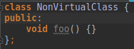
     <p align="center"><b>Figure 1.1</b></p>
  </div>
  <div class="column">
    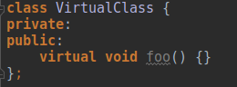
     <p align="center"><b>Figure 1.2</b></p>
  </div>
</div>


<figure align="center">
  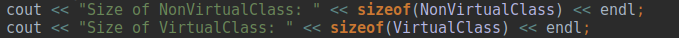
    <p align="center"><b>Figure 1.3</b></p>
</figure>


<br>
<figure align="center">
  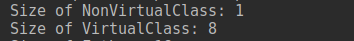
</figure>

  Firstly, if we want to understand how objects are structured in memory, we need to understand how much space is allocated and which is the difference between a simple  and a virtual method call. As we can see from the example above, the size of NonVirtualClass is 1, because the size in C ++ classes cannot be zero. However, the size of VirtualClass is 8 (if someone has 32-bit Architecture he will see 4) although practically one could ask why the size is different, since both classes have one method  without any private or public values. This difference is due to the fact that in the second case there is a hidden pointer in the internal memory object layout with cost of 4 bytes + 4 bytes of some padding which is added. This pointer points to a Virtual Table. This static table is created for each Virtual Class and contains the virtual methods of the class. More specifically, it is an implementation of dynamic dispatch pattern.
  In order to have a deeper sense of what is the role of a VTable and how it is structured into memory, we will consider the overall course of our exploration for the classes under the directory <a href="VTable/VBasicUnderstand">VBasicUnderstand</a> through the Execution and Debugging Screens. That is, the classes Parent and Derived.  

We compile our code with the following flags and start debugging using GDB as shown in the <b>Figure 1.4</b>.

```sh
clang++ -std=c++14 -stdlib=libc++ -g main.cpp && gdb ./a.out
```

<figure>
  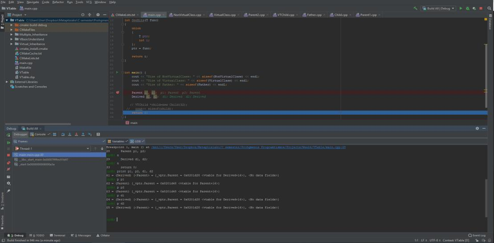
</figure>
<p align="center"><b><u>Figure 1.4</b></u></p>


  Let's analyze **Figure 1.4** and let's briefly look at the most important conclusions which can be drawn.

- As we said before, and as we can see from debugging, there are hidden pointers in VTables, so the size of the class is larger than expected although the classes have no private or public values.
- The Vtable is the same for the objects p1, p2. The reason is that, a Vtable is static for each different object created in memory of the same type. The compiler recognizes only the static part of the code, which is created, during the setting process. So, if an assignment or a conversion is dynamically performed, we will then see how the pointer will be adjusted correctly so that the argument is dynamically passed.
- All vtables point to an offset of space 16 in the decimal system or else in the <i>(0x10) BYTE</i> hexadecimal system (Let’s not forget that the main factor is the architecture of the compiler that runs our virtual machine 32 or 64). The compiler is smart enough to set a space between offsets to reduce the distance of the methods offsets in vtables. We will see a further analysis on this piece in the next section.


Continuing our exploration now we will use the command 

```sh Χ/size xb ```

of GDΒ in order to obtain a representation of the memory for the first 300 byte of memory. In this way we can further detect the memory for each object layout. For the class Derived we start from the first memory position of Derived


```sh
(gdb) x/300xb 0x8201d18
```

The reason we chose this memory to start is not accidental. As we can see below the pointer of Vtable is shifted in the offset 16=0x10 to 0x8201d28.

```sh
(gdb) x/300xb 0x8201d18
```


```sh
$5 = (Derived) {<Parent> = {_vptr.Parent = 0x8201d28 <vtable for Derived+16>}
```

So the header of the offset will be located in the memory address -0x10 of 0x8201d28 which means 0x8201d18. As shown  in **Figure 1.5**.

<figure>
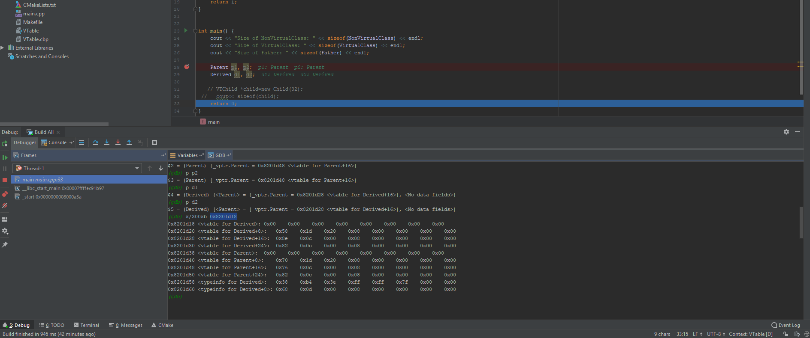
</figure>
<p align="center"><b>Figure 1.5</b></p>

  According to the <u>**Figure 1.5**</u> we can come to the following information as presented in <u>**Table 1.1**</u> and <u>**Table 1.2**</u>


<figure>
<table align="center">
  <tr>
    <th>Address</th>
    <th>Value</th>
    <th>Description</th>
  </tr>
  <tr>
    <td><b>0x8201d18</b></td>
    <td>0x0</td>
    <td>top_offset</td>
  </tr>
  <tr>
    <td><b>0x8201d20</b></td>
    <td>0x8201d58</td>
    <td>Pointer to typeinfo for Parent</td>
  </tr>
  <tr>
    <td><b>0x8201d28</b></td>
    <td>0x8000c8e</td>
    <td>Pointer to Parent::Foo(). <b>The pointerof vptr points here</b></td>
  </tr>
  <tr>
    <td><b>0x8201d30</b></td>
    <td>0x8000c82</td>
    <td>Pointer to Parent::FooNotOverridden()</td>
  </tr>
</table>
<p align="center"><b><u>Table 1.1</b></u></p>
</figure>

 Here is the memory layout for object Derived:

 <figure>
<table align="center">
  <tr>
    <th>Address</th>
    <th>Value</th>
    <th>Description</th>
  </tr>
  <tr>
    <td><b>0x8201d38</b></td>
    <td>0x0</td>
    <td>top_offset</td>
  </tr>
  <tr>
    <td><b>0x8201d40</b></td>
    <td>0x8201d70</td>
    <td>Pointer to typeinfo for Derived</td>
  </tr>
  <tr>
    <td><b>0x8201d48</b></td>
    <td>0x8000c76</td>
    <td>Pointer to Derived:Foo(). <b>The pointer ofου vptr points here<b></td>
  </tr>
  <tr>
    <td><b>0x8201d50</b></td>
    <td>0x8000c82</td>
    <td>Pointer to Derived:FooNotOverridden()</td>
  </tr>
</table>
<p align="center"><b><u>Table 1.2</b></u></p>
</figure>

 If we wanted to see the same results programmatically, we could use this short code of the example as shown below.


 ```C++
#include <cstdint>

uintptr_t p = 0x0001FBDC;
int value = *reinterpret_cast<int *>(p);

```


Let’s remember that the pointer to Vtable for the class Derived point to +16 bytes offset into vtable. <u>So the address of the third pointer in <b><u>Table 1.2</b></u> for the layout Derived contains the pointer of the first virtual method point to a virtual table</u>. For example, if we wanted to find the pointer of the third method for the table Vtable then we could surely write something which look like this one


 ```C++
2 * sizeof (void*)vptr
```

With a simpler way, we could give, for example, a similar command through the compiler as shown in <b><u>Figure 1.6</b></u>. This option was selected for finding the fields located in <b><u>Table 1.1</b></u> and <b><u>Table 1.2</b></u>


<figure>
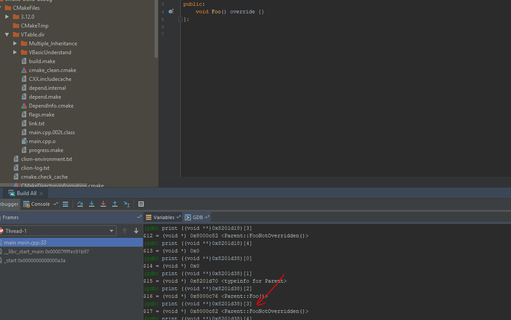
</figure>
<p align="center"><b><u>Figure 1.6</u></b></p>


Furthermore, in Figure 1.7 it is more understandable and we can discover the final file which includes the layout of the entire memory of our program. It can be easily created by running our program with the following option (always using GCC due to the fact that is it is a predetermined option) and contains equally useful information about the overall structure of the memory layout.

```sh
g++ -fdump-class-hierarchy -c main.cpp
```

<figure>
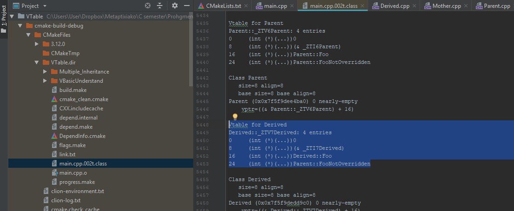
</figure>
<p align="center"><b><u>Figure 1.7</u></b></p>

Or through the  Cmake file:

```sh
set(CMAKE_CXX_FLAGS  " -std=c++11 -Wall -Wno-unused-variable  -fdump-class-hierarchy -o main.cpp")
```


# B.	MULTIPLE INHERITANCE 

In the previous section we saw an example with a single inheritance. In this subsection we will study an example using multiple inheritance and we will explore how the memory objects layout behaves in this case. Generally speaking the process that we will follow  will be the same as before, that means using  GDB. Running the previous commands we observe in <b><u>Figure  2.1</b></u> the new memory layout for the classes of the objects located under the directory <a href="Vtable/Multiple_Inheritance">MultipleInheritance</a>.


<figure>
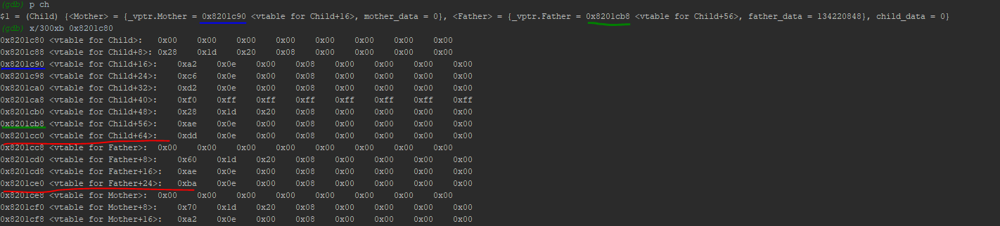
</figure>
<p align="center"><b><u>Figure 2.1</u></b></p>


<figure>
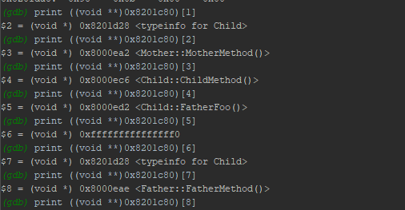
</figure>
<p align="center"><b><u>Figure 2.2</u></b></p>

Here is the memory object layout of Child:


<figure>
<table align="center">
  <tr>
    <th>Address</th>
    <th>Value</th>
    <th>Description</th>
  </tr>
  <tr>
    <td><b>0x8201c80</b></td>
    <td>0x0</td>
    <td>top_offset</td>
  </tr>
  <tr>
    <td><b>0x8201c88</b></td>
    <td>0x8201d28</td>
    <td>Pointer to typeinfo for Child</td>
  </tr>
  <tr>
    <td><b>0x8201c90</b></td>
    <td>0x8000ea2</td>
    <td>Pointr to Mother::MotherMethod() The pointer of  vptr points here<b></td>
  </tr>
  <tr>
    <td><b>0x8201c98</b></td>
    <td>0x8000ec6</td>
    <td>Child::ChildMethod()</td>
  </tr>
  <tr>
    <td><b>0x8201ca0</b></td>
    <td>0x8000ed2</td>
    <td>Child::FatherFoo()</td>
  </tr>
  <tr>
    <td><b>0x8201ca8</b></td>
    <td>-16</td>
    <td>top_offset</td>
  </tr>
  <tr>
    <td><b>0x8201cb0</b></td>
    <td>0x8201d28</td>
    <td>Pointer to typeinfo for Child</td>
  </tr>
  <tr>
    <td><b>0x8201cb8</b></td>
    <td>0x8000eae</td>
    <td>Father: FatherMethod () The pointer of vptr points here</td>
  </tr>
  <tr>
    <td><b>0x8201cc0</b></td>
    <td>0x8000edd</td>
    <td><b>non-virtual thunk to Child:FatherFoo()</b></td>
  </tr>
</table>
<p align="center"><b><u>Table 2.1</b></u></p>
</figure>


   <p>Let’s explore the objects of type Child. The first difference we note here compared to the single inheritance, is that in the case of multiple inheritance we have objects of type Child <b> with two vptr pointers </b>, which is equally as the different paths which are inherited. More Specifically, in our case we saw two pointers point in two different vtable for each case, one for the class Mother and one for the class Father according to <b><u>Figure 2.1</u></b>. 
  <u>One might wonder why we should waste so much space and not having a vptr for both cases?</u></p>
  <p><b>The answer</b> is that practically it is not possible to happen in the multiple inheritance. Let’s take for example an object of type Child which is passed to a function that accepts a pointer to Father or Mother. Both functions wait for the pointer <b>"this"</b> to be adjusted at a proper offset. But this setting is practically impossible to happen with only one vptr because a method cannot simultaneously playing the role of two or more different dynamic objects (Father and mother). So, the solution to our problem is that there should be two <b>vptr pointers </b>. Thus, the parameter of <b>this</b> to be set correctly in each offset in order to call the corresponding method based on the dynamic type of the object (Father or Mother).</p>


 <p>Our second comment now that we conclude from the <b><u>Figure 2.1</b></u> and the <b><u>Table 2.1</b></u> as we have exported their addresses and their values to pointers in the appropriate offset is why <u>the fields of Child object should be placed close and sequentially after the class Mother and why they should have the same pointer 0x8201c90?</u>

More specifically, one might wonder why there are no <b>3 vptr pointers</b>  in Vtables?</p>


The answer is very simple. The compiler is smart enough to combine and <b>merge</b> the fields of the Child in continuous flow with the fields of the Mother saving the cost of a pointer. In order to do this, however, it must set a space between the offsets of the vtables methods in such a way that not create any overlap. <b>Hence, we can deduce the following.</b>

-	<u>On the one hand, we have a negative that we add several empty positions, having a quite large VTable.
-	On the other hand, however, the compiler takes advantage of the fact that it sets big spaces, something that it enables it to easily merge methods of VTable without overlapping the offsets. (For example this may be necessary for faster Serialization).</u>


<b>As a last and most important remark</b> one might wonder is the following occasion. As we can see from the source code (the classes under the directory <a href="VTable/Multiple_Inheritance">MultipleInheritence</a>), there is a method FatherFoo() of the class Father which is overridden by the Child. Let's suppose, for example, that we have a function that gets a pointer to Father and its implementation calls the FatherFoo then then we normally expect to call Father: FatherFoo(). But if we get an instance of Father but with a <b>dynamic value</b> points to Child which is like the following:

```c++
Child child;
Father *father = &child;
father->FatherFoo();
//Child::FatherFoo() will be called
```


due to the fact that the FatherFoo is overridden by the Child we expect to call Child: FatherFoo(). <u>The key question now is how to properly adjust the offset with the proper pointer to <b>"this" adjustment</b> so as finally to call and to determine the right method of the VTable.</u>


 <b>According</b> to the above code. This means that statically the compiler will find the offset of the pointer  for the VTable Father but before calling the method Father: FatherFoo() it will pass from a dynamic piece of code which is called <b>thunk</b> adjustment <u>(is the dynamic call which adjust the pointer to <b>this</b> only if there is a problem just like in our example). As we can see from <b>Table 2.1</b> and as shown in Figure 2.3 from the column "values",  the memory position <i>0x8000edd</i>,  will switch directly and jump   with not any special overhead at the correct memory position <i>0x8000ed2</i> in order to make the correct offset adjustment and finally call the correct  method Child: FatherFoo() which overrides Father: FatherFoo().</u>

<figure>
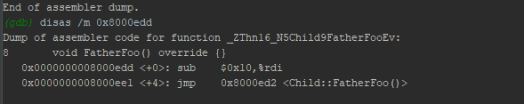
</figure>
<p align="center"><b><u>Figure 2.3</u></b></p>

 <b>Attention!!</b> <i>Note here that the problem of this special dynamic translation which is done through thunk for correcting the offset would not exist if the class Child would override from Mother and made the cast because the compiler puts the methods of child close and under the same vtable of Mother so through the pointer to <b>"this"</b> there would be the right method for the child without having to move to a dynamic piece of code and switch to another memory address.</i>


 # C.	VIRTUAL INHERITANCE

 In the previous sections we have seen how the  memory layout of objects exists in memory in the simple cases. The one with the single and the other with multiple inheritance. In this section we will deepen further to explore what is happening in the case of Virtual inheritance. The source code for this example is under the subdirectory <a href="Vtable/Virtual_Inheritance">Virtual_Inheritance</a>. However, before we begin the further deepening, let's see how how we separate intuitively this two different occasions. This difference appears by defining the keyword virtual when we inherit as shown below.

<figure>
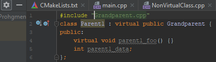
</figure>
<p align="center"><b><u>Figure 3.1</u></b></p>

 Practically this means, that in the memory management layout of the VChild as shown in the following figure, we expect the Grandparent instance to be uniquely identified onle once and play the role both for the Parent 1 or 2. As opposite, with the multiple inheritance where each parent should have his own GrandParent. As a result, its offset of the virtual methods must be adjusted appropriately hence, we can visit the correct methods when they react as Parent1 or Parent2


<figure>
<div style="display: flex; justify-content: center;">
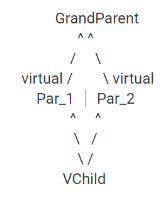
</div>
</figure>

 In <b><u>Figure 3.2</b></u> we observe the memory layout in the case of virtual inheritance. We are impressed by the fact that there is enough new material to study that we had not met before.


Initially our <u>first point</u> about this example  is that we have <b>3  Vptr pointers</b> which point to 3 different VTables. The reason is that the class VChild has only one unique instance of Grandparent type as we explained before. In addition, we observe a further new remarkable facts. We observe that they are exist two new tables for the VChild representation. The first one is a VTT table and the other one is a <b><u>Construction vtable for Parent1-in-Child</b></u> and <b><u>Construction vtable for Parent2-in-Child</b></u>. We will explain their role afterwards, but for now let’s continue and  see something very interesting in Table 3.1 for the VChild object.


<figure>
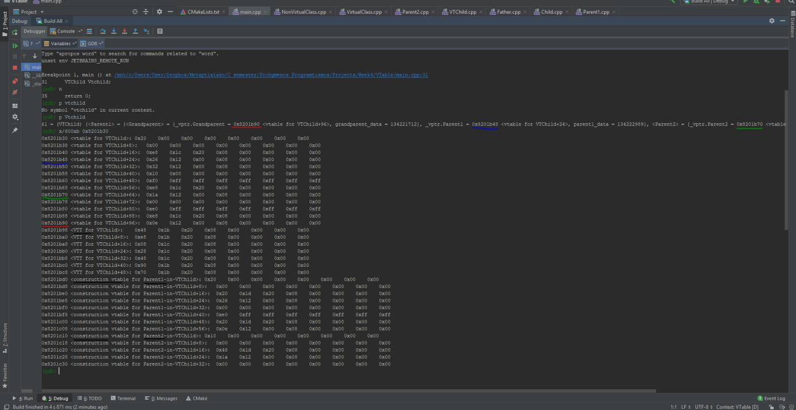
</figure>
<p align="center"><b><u>Figure 3.2</u></b></p>


Here is the memory object layout of VChild:


<figure>
<table align="center">
  <tr>
    <th>Address</th>
    <th>Value</th>
    <th>Description</th>
  </tr>
  <tr>
    <td><b>0x8201b30</b></td>
    <td>0x20(32)</td>
    <td style="background:yellow"><b>virtual-base offset</b></td>
  </tr>
  <tr>
    <td><b>0x8201b38</b></td>
    <td>0x0</td>
    <td>top_offset</td>
  </tr>
  <tr>
    <td><b>0x8201b40</b></td>
    <td>0x8201ce8</td>
    <td>Pointer to typeinfo for Child<b></td>
  </tr>
  <tr>
    <td><b>0x8201b48</b></td>
    <td>0x8001226</td>
    <td>Pointer to Parent1::parent1_foo() <b>The
Pointer of vptr points here</b>
</td>
  </tr>
  <tr>
    <td><b>0x8201b50</b></td>
    <td>0x8001232</td>
    <td><b>Child::child_foo()</b></td>
  </tr>
  <tr>
    <td><b>0x8201b58</b></td>
    <td>0x10(16)</td>
    <td style="background:yellow"><b>virtual-base offset</b></td>
  </tr>
  <tr>
    <td><b>0x8201b60</b></td>
    <td>0xfffffffffffffff0(-16)</td>
    <td>top_offset</td>
  </tr>
  <tr>
    <td><b>0x8201b68</b></td>
    <td>0x8201ce8</td>
    <td>Pointr to typeinfo for Child</td>
  </tr>
   <tr>
    <td><b>0x8201b70</b></td>
    <td>0x800121a</td>
    <td>Pointer to Parent2::parent2_foo() <b>The
Pointer of vptr points here</b>
</td>
  </tr>
   <tr>
    <td><b>0x8201b78</b></td>
    <td>0x0</td>
    <td style="background:yellow"><b>virtual-base offset</b></td>
  </tr>
   <tr>
    <td><b>0x8201b80</b></td>
    <td>0xffffffffffffffe0(-32)</td>
    <td>top_offset</td>
  </tr>
   <tr>
    <td><b>0x8201b88</b></td>
    <td>0x8201ce8</td>
    <td>Pointer to typeinfo for Child</td>
  </tr>
   <tr>
    <td><b>0x8201b90</b></td>
    <td>0x800120e</td>
    <td>Pointer to GrandParent::grandparent_foo().
    <b> The pointer of vptr points here</b>
</td>
  </tr>
</table>
<p align="center"><b><u>Table 3.1</b></u></p>
</figure>

<figure>
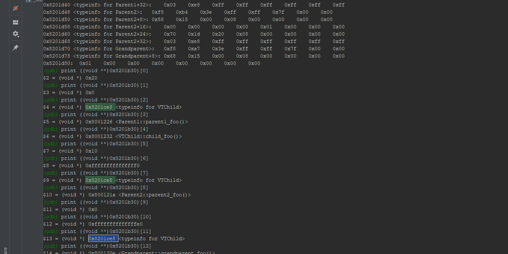
</figure>
<p align="center"><b><u>Figure 3.3</u></b></p>


A very impressive fact that not arise from memory layout of VChild is the following. In the case of Virtual inheritance when the Child object inherits from Parent and that in its turn inherits virtual the GrandParent, then the constructor of the second one is called directly. This means that the GrandParent constructor will be called firstly and after this,  the constructor of Parent1 or 2 will be called. A fact that is opposed to multiple inheritance where the Parent 1 is first called, because in that case each Parent has its own Hyperclass. <u> Furthermore, the question that now arises, is how the compiler will know where it will find  the data and methods in order to got access on the Grandparent instance when we build a Parent1 or a Parent 2, since the object Grandparent has already been built before</u>


The answer here is that  the compiler needs to make the proper offset adjustment differentially from before. As a result, this lead to enters into the <u>construction table of Parent1-child</u> or <u> construction table of Parent2-child</u> (Example Table 3.2 for <u>Parent1-child</u>). More specifically it retains a different offset which is called <b>Virtual-base-Offset</b> and it is used when <b>we inherit from virtual classes</b>. With this way, the compiler looks at the construction tables so it can be informed  about the location of the objects(parent 1 or 2), in order to <b>jump</b> in front of <b>this pointer</b> of the Grandparent instance and got access to those methods. 


Here is the memory layout for the <b> construction vtable for Parent1 in VTChild</b> (Similar applies to Parent2): 


<figure>
<table align="center">
  <tr>
    <th>Address</th>
    <th>Value</th>
    <th>Description</th>
  </tr>
  <tr>
    <td><b>0x8201bd0</b></td>
    <td>0x20(32)</td>
    <td><b>virtual-base offset</b></td>
  </tr>
  <tr>
    <td><b>0x8201bd8</b></td>
    <td>0x0</td>
    <td>top_offset</td>
  </tr>
  <tr>
    <td><b>0x8201be0</b></td>
    <td>0x8201d20</td>
    <td>typeinfo for Parent1 <b></td>
  </tr>
  <tr>
    <td><b>0x8201be8</b></td>
    <td>0x8001226</td>
    <td>Parent1::parent1_foo()</td>
  </tr>
  <tr>
    <td><b>0x8201bf0</b></td>
    <td>0x0</td>
    <td><b>virtual-base offset</b></td>
  </tr>
  <tr>
    <td><b>0x8201bf8</b></td>
    <td>0xffffffffffffffe0(-32)</td>
    <td>top_offset</td>
  </tr>
  <tr>
    <td><b>0x8201c00</b></td>
    <td>0x8201d20</td>
    <td>typeinfo for Parent1</td>
  </tr>
  <tr>
    <td><b>0x8201c08</b></td>
    <td>0x800120e</td>
    <td>Grandparent::grandparent_foo()</td>
  </tr>
</table>
<p align="center"><b><u>Table 3.2</b></u></p>
</figure>

Here is the memory layout for the <b>VTT</b>:
<figure>
<table align="center">
  <tr>
    <th>Address</th>
    <th>Value</th>
    <th>Description</th>
  </tr>
  <tr>
    <td><b>0x8201b98</b></td>
    <td>0x8201b48</td>
    <td><b>vtable for VTChild+24</b></td>
  </tr>
  <tr>
    <td><b>0x8201ba0</b></td>
    <td>0x8201be8</td>
    <td>construction vtable for Parent1-in-VTChild+24</td>
  </tr>
  <tr>
    <td><b>0x8201ba8</b></td>
    <td>0x8201c08</td>
    <td>construction vtable for Parent1-in-VTChild+56<b></td>
  </tr>
  <tr>
    <td><b>0x8201bb0</b></td>
    <td>0x8201c28</td>
    <td>construction vtable for Parent2-in-VTChild+24</td>
  </tr>
  <tr>
    <td><b>0x8201bb8</b></td>
    <td>0x8201c48</td>
    <td><b>construction vtable for Parent2-in-VTChild+56</b></td>
  </tr>
  <tr>
    <td><b>0x8201bc0</b></td>
    <td>0x8201b90</td>
    <td>vtable for VTChild+96</td>
  </tr>
  <tr>
    <td><b>0x8201bc8</b></td>
    <td>0x8201b70</td>
    <td>vtable for VTChild+64</td>
  </tr>
</table>
<p align="center"><b><u>Table 3.3</b></u></p>
</figure>


  From the Figure 3.3  we observe the structure of VTT. This table is a table from VTables and its basically  role is to make the right translation and switch to the corresponding virtual table. In order for the compiler to switch to the corresponding offset of the construction table, it first looks at the VTT. VTT contains all the available VTables and, depending on each case, it can calculate the correct offset and jump there as shown in <b>Table 3.3</b>. <u>For example when the constructor is called for Parent 1 the compiler, through VTT, will be transferred correctly through <b>virtual offset</b> into table Parent 1, hence it knows that it will access the methods of GrandParent through Parent 1 construction table</u>.
  
